## Emotion Classification in a Resource Constrained Language Using Transformer-based Approach

**Author:** Avishek Das, Omar Sharif, Mohammed Moshiul Hoque and Iqbal H. Sarker

**Venue:** [NAACL Student Research Workshop (SRW)-2021](https://naacl2021-srw.github.io/)

## Abstract

Although research on emotion classification has significantly progressed in high-resource languages, it is still infancy for resource-constrained languages like Bengali. However, unavailability of necessary language processing tools and deficiency of benchmark corpora makes the emotion classification task in Bengali more challenging and complicated. This work proposes a transformer-based technique to classify the Bengali text into one of the six basic emotions: anger, fear, disgust, sadness, joy, and surprise.  A Bengali emotion corpus consists of 6243 texts is developed for the classification task. Experimentation carried out using various machine learning (LR, RF, MNB, SVM), deep neural networks (CNN, BiLSTM, CNN+BiLSTM) and transformer (Bangla-BERT, m-BERT, XLM-R) based approaches. Experimental outcomes indicate that XLM-R outdoes all other techniques by achieving the highest weighted f1-score of 69.73\% on the test data.

## Contribution

- Develop a Bengali emotion corpus consisting of 6243 text documents with manual annotation to classify each text into one of six emotion classes: anger, disgust, fear, joy, sadness, surprise. 
- Investigate the performance of various ML, DNN and transformer-based approaches on the corpus.
- Proposed a benchmark system to classify emotion in Bengali text with the experimental validation on the corpus.

## Dataset Analysis

Table 1 represents the amount of data in each class according to the train-validation-test set.

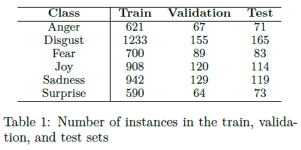

To get the useful insights, we investigated the train set. Statistics of the train set exhibited in table 2.

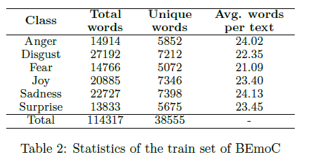


Figure 1 represents the number of texts vs the length of texts distribution for each class of the corpus.

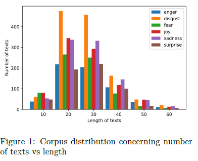

For quantitative analysis, the Jaccard similarity among the classes has been computed. We used 200 most frequent words from each emotion class, and the similarity values are reported in table 3.

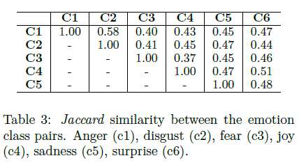

## Methodology

Figure 2 shows an abstract view of the used strategies. Various feature extraction techniques such as TF-IDF, Word2Vec, and FastText are used to train ML and DNN models. Moreover, we also investigate the Bengali text's emotion classification performance using transformer-based models. All the models are trained and tuned on the identical dataset.

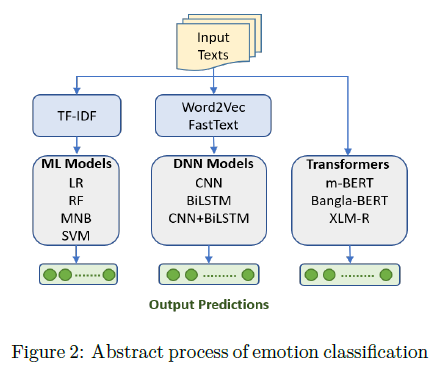

Hyperparameters of different models are summarized in the following tables.

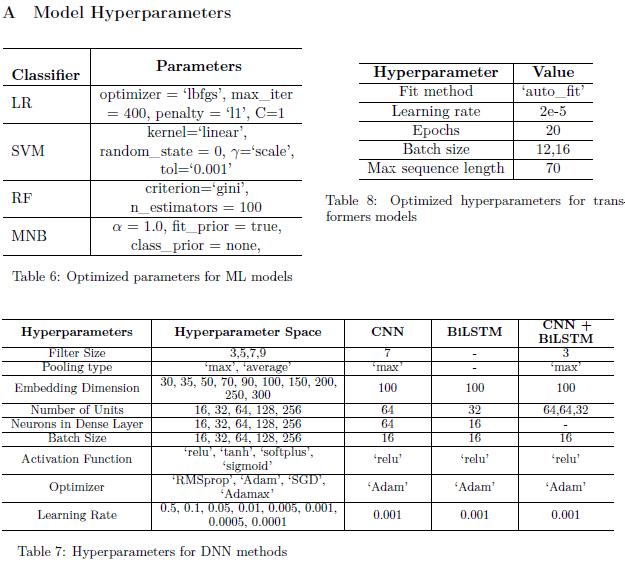

## Result and Analysis

The superiority of the models is determined based on the weighted f1-score. However, the precision (Pr), recall (Re) and accuracy (Acc) metrics also considered. Table 4 reports the evaluation results of all models.

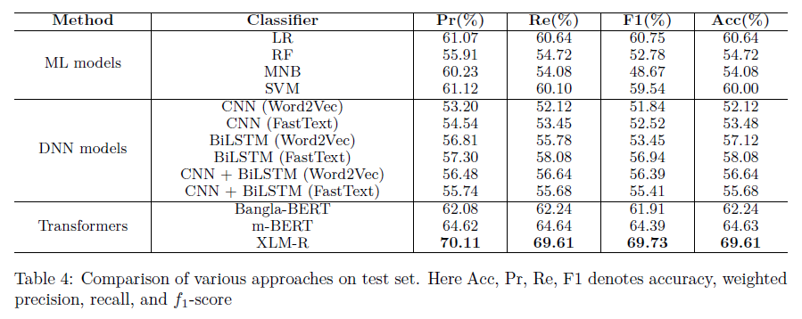

## Error Analysis
It is evident from Table 4 that XLM-R is the best performing model to classify emotion from Bengali texts. A detailed error analysis is performed using the confusion matrix. Figure 3 illustrates a class-wise proportion of the number of predicted labels.

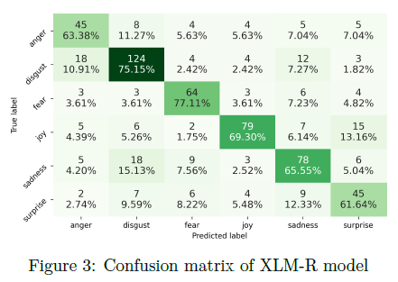

The analysis of results revealed that XLM-R is the best model to classify emotion in Bengali texts. Thus, we compare the performance of XLM-R with the existing techniques to assess the effectiveness. Table 5 shows a summary of the comparison.

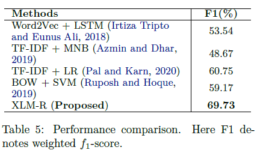


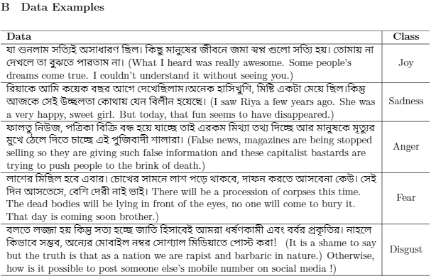
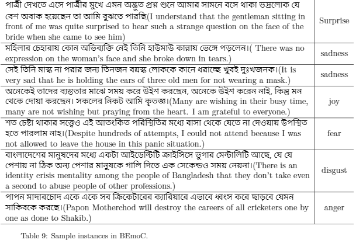


## Ackonwlegements
We sincerely acknowledge the anonymous reviewers and pre-submission mentor for their insightful suggestions, which help to improve the work. This work was supported by the Directorate of Research & Extension, CUET. Thanks to [Prof. Dr. Mohammed Moshiul Hoque](https://www.researchgate.net/profile/Moshiul_Hoque) and [Dr. Iqbal H. Sarker](https://www.sites.google.com/site/iqbalsarkercse/) sir for their valuable guidance.

## Cite this work
If you find this repository helpful in your work please cite the following
```
@article{das2021emotion,
  title={Emotion Classification in a Resource Constrained Language Using Transformer-based Approach},
  author={Das, Avishek and Sharif, Omar and Hoque, Mohammed Moshiul and Sarker, Iqbal H},
  journal={arXiv preprint arXiv:2104.08613},
  year={2021}
}
```

## Note
`If you find any anomaly or have any query/suggestion feel free to ping.`
